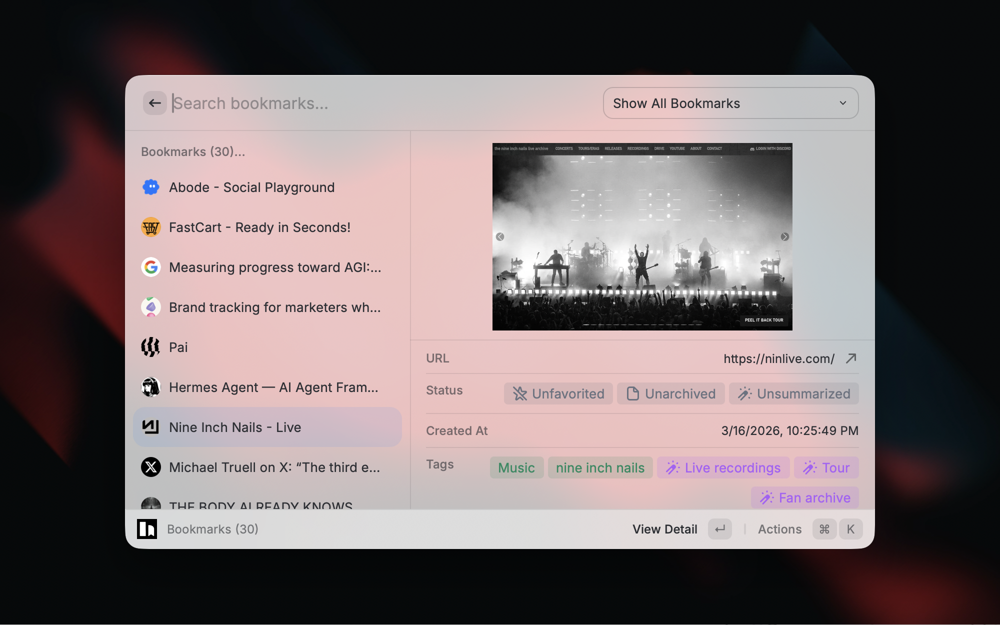

# Raycast Karakeep


A Raycast extension for [Karakeep](https://github.com/karakeep-app/karakeep), a self-hostable bookmark manager with AI-powered tagging. Save, search, and manage your bookmarks, notes, and highlights without leaving Raycast.



## Installation

### Option 1: Raycast Store

- [ ] Install directly from [Raycast Store: Karakeep](https://zuoluo.tv/raycast-karakeep)

### Option 2: Manual Installation

```bash
git clone https://github.com/foru17/raycast-karakeep.git
cd raycast-karakeep
npm install && npm run dev
```

## Features

### Commands

- **Bookmarks** — Browse, search, and manage your full bookmark collection. Filter by list, favorite, archive, summarize with AI, and copy links.
- **Lists** — Create, edit, and delete lists including smart lists with query-based filtering.
- **Tags** — Create, rename, and delete tags.
- **Notes** — View and manage text notes (bookmarks of type "text").
- **Highlights** — View, edit, and delete highlights saved from web pages.
- **Backups** — Create, download, and delete account backups. Backup status updates automatically — the list polls while a backup is in progress.
- **My Stats** — Overview of your library: bookmark counts by type, top domains, top tags, activity over time, and storage usage with charts.
- **Create Bookmark** — Add a new URL bookmark, optionally prefilled from your active browser tab.
- **Create Note** — Add a new text note.
- **Quick Bookmark** — Instantly bookmark the current browser tab with a single hotkey.

### Browser Extensions

Install the Karakeep browser extension to save pages directly from your browser and create highlights. Links to Chrome, Firefox, and Safari extensions are available from the Actions panel on any bookmark.

- [Chrome Extension](https://chromewebstore.google.com/detail/karakeep/kgcjekpmcjjogibpjebkhaanilehneje)
- [Firefox Add-on](https://addons.mozilla.org/en-US/firefox/addon/karakeep/)
- [Safari Extension](https://apps.apple.com/us/app/karakeeper-bookmarker/id6746722790)

## Prerequisites

- A running [Karakeep](https://docs.karakeep.app/Installation/docker) instance
- A Karakeep API key — create one at `https://your-karakeep-instance.com/settings/api-keys`
- Raycast installed on macOS

## Configuration

1. Open Raycast Preferences → Extensions → Karakeep
2. Enter your Karakeep API URL and API key

You can also customize default actions for link and text bookmarks, and choose which bookmark details to display (tags, description, note, summary, creation date, preview image).

## Troubleshooting

1. Verify your API URL and key are correct
2. Ensure your Karakeep instance is running and accessible
3. Check the Raycast console for error messages

If problems persist, [open an issue](https://github.com/chrismessina/raycast-karakeep/issues) on GitHub.

## Contributing

1. Fork the repository
2. Create a feature branch: `git checkout -b my-new-feature`
3. Commit your changes and open a pull request

## Credits

Built on top of the [Karakeep](https://github.com/karakeep-app/karakeep) project.

Thanks to [@kdurek](https://github.com/kdurek) for the original Raycast Karakeep extension, and to [@foru17](https://github.com/foru17) for the enhanced version this is based on.

## License

MIT — see [LICENSE](LICENSE) for details.
